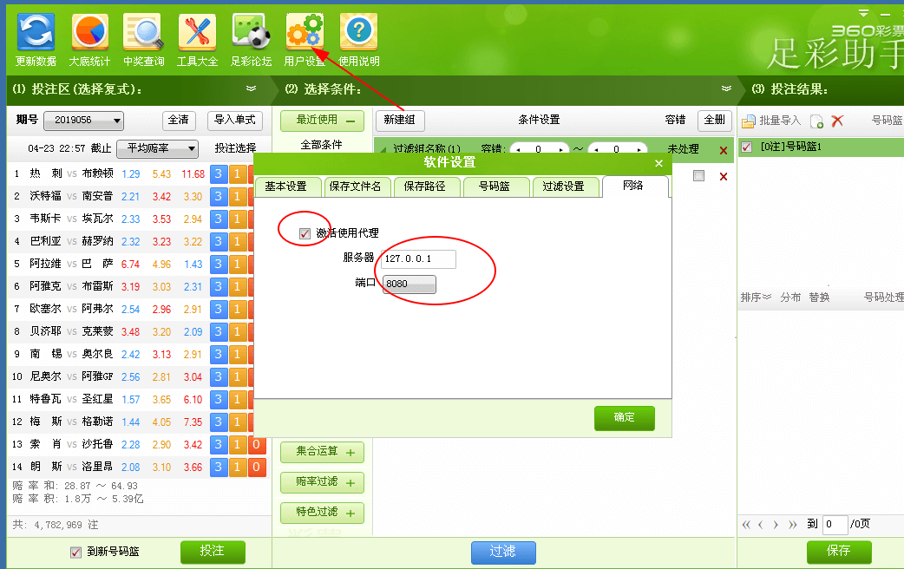

# 软件说明

> 请手工编辑`sfc`、`jqc`目录下`.toml`来实现对阵、赔率数据更新(可用记事本打开)。
> 
> 历史期数据可挪历史目录

## 使用方法

- 启动程序
- 启动足彩助手
- 设置足彩助手代理

## 如何激活软件代理

软件需要`0.3.7052`或更新版本

## 激活软件代理设置

如果使用本地代理服务，直接设置服务器：`127.0.0.1`.

>如足彩助手感觉不正常，可在设置代理后关闭软件，打开`C:\ProgramData\360lot\cache` 删除里面文件。